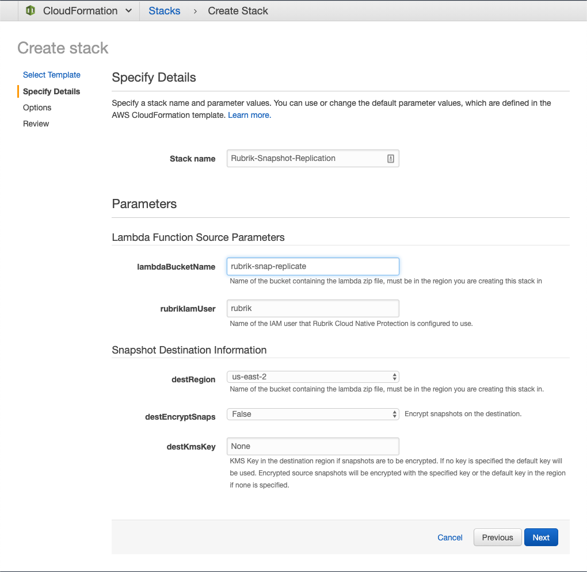

# Use Case: AWS Native Snapshot Replication

This module takes EC2 snapshots that were created by Rubrik and replicates them to another region. Replicated snapshots will be removed when the source snapshot is removed.

## :hammer: Installation

1. Create an S3 bucket for the lambda package in the same region as the Rubrik created snapshots that are to be replicated.
2. Upload [rubrik-aws-ec2-snap-replicate.zip](rubrik-aws-ec2-snap-replicate.zip) to the previously created bucket.
3. Create a new CloudFormation stack using the template from the Rubrik bucket[http://s3.us-west-1.amazonaws.com/cloudformation-templates-rubrik-prod/rubrik-aws-ec2-snap-replicate.yml](http://s3.us-west-1.amazonaws.com/cloudformation-templates-rubrik-prod/rubrik-aws-ec2-snap-replicate.yml]) or from this repo [rubrik-aws-ec2-snap-replicate.yml](rubrik-aws-ec2-snap-replicate.yml)
4. New snapshots will be replicated to the destination region.

## :mag: Example CloudFormation Setup

## :blue_book: Documentation

Here are some resources to get you started! If you find any challenges from this project are not properly documented or are unclear, please raise an issue and let us know! This is a fun, safe environment - don't worry if you're a GitHub newbie! :heart:

* [Quick Start Guide](docs/quick-start.md)
* [Rubrik API Documentation](https://github.com/rubrikinc/api-documentation)

## :muscle: How You Can Help

We glady welcome contributions from the community. From updating the documentation to adding more functions for Python, all ideas are welcome. Thank you in advance for all of your issues, pull requests, and comments! :star:

* [Contributing Guide](CONTRIBUTING.md)
* [Code of Conduct](CODE_OF_CONDUCT.md)

## :pushpin: License

* [MIT License](LICENSE)

## :point_right: About Rubrik Build

We encourage all contributors to become members. We aim to grow an active, healthy community of contributors, reviewers, and code owners. Learn more in our [Welcome to the Rubrik Build Community](https://github.com/rubrikinc/welcome-to-rubrik-build) page.

We'd  love to hear from you! Email us: build@rubrik.com :love_letter:
