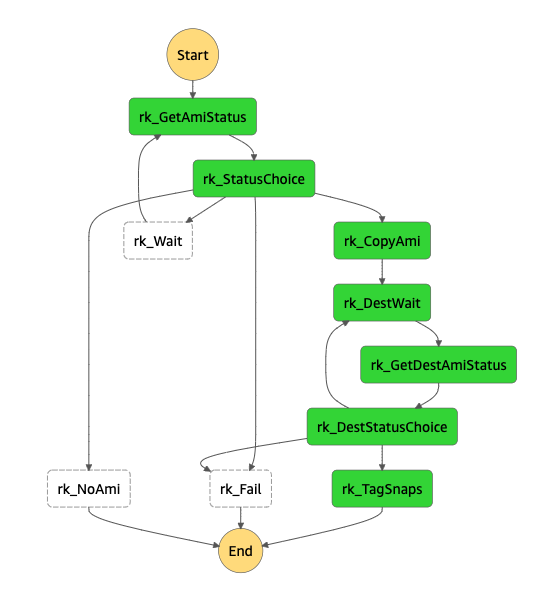

# Quick Start Guide: AWS Snapshot Replication for Rubrik EC2 Native Protection

Rubrik’s API first architecture enables organizations to embrace and integrate Rubrik functionality into their existing automation processes. This includes integration with services offered by public cloud providers such as Amazon Web Services, Google Cloud Platform, and Microsoft Azure.

One such public cloud service is Amazon EC2 and it's native capabilities for protecting cloud instances using Amazon AMI snapshots. Rubrik CDM integrates with Amazon EC2 APIs to provide simple and unified management of Amazon AMI snapshots across multiple AWS Regions and AWS accounts. While Rubrik CDM will create snapshots it will not create copies of those snapshots natively. Instead this package can be used to replicate snapshots that are created by Rubrik CDM to another region.

This package uses a combination of AWS CloudWatch Events, AWS Step Functions and AWS Lambda functions to look for new snapshots that are created by CDM and replicate them to an alternate region. It will replicate both unencrypted and encrypted snapshots. It will also encrypt unencrypted snapshots if needed. Last as CDM expires snapshots this package will expire the replicated snapshot as well.

## Deployment

1. Create an S3 bucket for the lambda package in the same region as the Rubrik created snapshots that are to be replicated.
1. Upload [rubrik-aws-ec2-snap-replicate.zip](../rubrik-aws-ec2-snap-replicate.zip) to the previously created bucket.
1. Create a new CloudFormation stack using the template from the Rubrik bucket[http://s3.us-west-1.amazonaws.com/cloudformation-templates-rubrik-prod/rubrik-aws-ec2-snap-replicate.yml](http://s3.us-west-1.amazonaws.com/cloudformation-templates-rubrik-prod/rubrik-aws-ec2-snap-replicate.yml]) or from this repo [rubrik-aws-ec2-snap-replicate.yml](../rubrik-aws-ec2-snap-replicate.yml)

| Parameter | Description |
| --------- | ----------- |
| lambdaBucketName | The bucket in step 1 where the zip file from step 2 was uploaded. |
| rubrikIamUser | The IAM user that Rubrik CDM is using to protect EC2 Native workloads. |
| destRegion | The region that Rubrik CDM generated snapshots will be replicated to. |
| destEncryptSnaps | Encrypt snapshots in the target region. This only effects unencrypted snapshots. Encrypted snapshots will automatically be encrypted with the default encryption key of the target region if this set to `False`. |
| destKmsKey | KMS key in the target region used to encrypt snapshots. Setting this to `Default` will use the default encryption key in the target region. Setting this to an encryption key in the target region will cause all snapshots to be encrypted with that key. |

**Example**

1. After creating the Stack all new New snapshots that are created by Rubrik CDM will automatically be replicated to the destination region. As snapshots are expired by Rubrik CDM their replicas will also be expired.

## Operation

This package works by using a CloudWatch event to find any new snapshots that are created with the tag `rk_cloud_native_feature_type` and a value of `CREATE_CLOUD_NATIVE_VM_SNAPSHOT`. These snapshots are passed to the `rk_CopySnap` Step Function. This Step Function is used to maintain state between the series of Lambda scripts that it runs to replicate the snapshot. State is passed from one Lambda function to another. State may be modified by each function as it is passed along.

Replica snapshots are deleted by a second CloudWatch event that looks for AMI images that are deregistered by the Rubrik IAM user.

If snapshots are not replicating properly the Step Function input and output parameters can be followed to see what snapshots are being selected. The CloudWatch logs for the Lambda functions can be monitored for error messaging.

Additional messaging can be enabled by setting the `debug` parameter in the `<Stack-Name>-cloudWatchEventRuleRepli-<ID>` CloudWatch Event Rule to `true`. This is done by editing the rule and changing the `debug` parameter in the Input Transformer under Target.